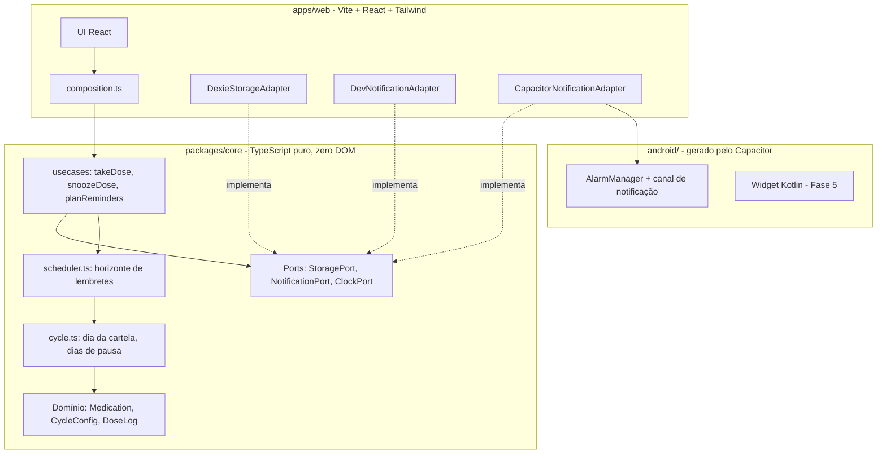

# 00 — Arquitetura e Decisões Globais

Documento transversal. Descreve a arquitetura que todas as fases seguem e registra as
decisões que valem para o projeto inteiro. Decisões específicas de uma fase ficam no
documento da fase.

## Visão geral

O Pillify usa **arquitetura hexagonal** (ports and adapters). O domínio é TypeScript puro,
sem nenhuma dependência de navegador, de framework ou de plataforma nativa. Tudo que é
plataforma entra por interfaces declaradas pelo próprio domínio.

Isso não é preciosismo arquitetural: é a condição para o app rodar como página web durante o
desenvolvimento e como APK Android na validação, sem duas bases de código.



### Regra de dependência

As setas apontam sempre para dentro. `packages/core` **não pode** importar nada de
`apps/web`, nem de `@capacitor/*`, nem tocar em `window`, `document`, `localStorage` ou
`Date.now()` diretamente. Essa regra é verificada por lint (ver
[Fase 0](fase-0-scaffold.md#regras-de-lint-que-protegem-a-arquitetura)).

### Ports definidos pelo domínio

```ts
interface ClockPort {
  now(): Date;
  timeZone(): string;
}

interface StoragePort {
  getMedications(): Promise<Medication[]>;
  saveMedication(med: Medication): Promise<void>;
  getDoseLogs(range: DateRange): Promise<DoseLog[]>;
  upsertDoseLog(log: DoseLog): Promise<void>;
}

interface NotificationPort {
  requestPermission(): Promise<PermissionState>;
  schedule(reminders: PlannedReminder[]): Promise<void>;
  cancel(reminderIds: string[]): Promise<void>;
  listPending(): Promise<string[]>;
}
```

`NotificationPort` é intencionalmente **declarativo e idempotente**: recebe o conjunto de
lembretes desejado, não comandos imperativos de "agendar mais um". Isso permite que a
estratégia de replanejamento (ver ADR-004) seja trivial e que cada adapter resolva do seu
jeito o que significa "garantir que esses lembretes existam".

---

## ADR-001 — Validação em Android nativo, e não em PWA

**Status:** aceita
**Contexto:** o briefing original previa PWA como Fase 1 e Capacitor como Fase 2.

O produto se propõe a resolver lembretes ignorados. Se validarmos num ambiente onde a
notificação é o elo mais fraco, um resultado negativo não distingue "o conceito falhou" de
"o navegador engoliu o alerta".

Foram avaliadas quatro rotas para lembrete agendado com o app fechado:

| Rota | Veredito |
| --- | --- |
| Notification Triggers API (`TimestampTrigger`) | Descartada. Nunca saiu do flag `#enable-experimental-web-platform-features`; o origin trial expirou no Chrome 86. Em Chrome Android padrão, `'showTrigger' in Notification.prototype` é `false`. |
| Periodic Background Sync | Descartada como alarme. `minInterval` é sugestão; o Chrome entrega a cada 12h (engajamento máximo) a 36h (engajamento mínimo), só em Chromium, só com PWA instalado e em rede conhecida. |
| Web Push com backend agendador (VAPID) | Descartada para o MVP. Exige rede no momento da entrega, o que contradiz o offline-first, e o WebKit ignora o campo `actions`, eliminando os botões "Tomei" e "Adiar" no iOS. |
| Capacitor + `@capacitor/local-notifications` | **Escolhida.** `AlarmManager` do Android dá horário exato, offline, com botões acionáveis reais e canal de som de prioridade. |

**Decisão:** o navegador é o ambiente de desenvolvimento (hot reload, DevTools) e o APK
Android por sideload é o ambiente de validação. Para uso pessoal não há necessidade de Play
Store.

**Consequências:**

- Ganho inesperado: **não precisamos de service worker customizado**. Na rota PWA, o handler
  de `notificationclick` teria que gravar no IndexedDB sozinho com o app fechado, forçando
  `packages/core` e o Dexie a rodarem também no contexto do service worker. Com o Capacitor,
  o plugin acorda o app e entrega o evento na camada JS normal.
- O `vite-plugin-pwa` sai do MVP e volta na [Fase 5](fase-5-pos-validacao.md), se houver
  interesse em distribuição web.
- Passa a existir dependência de Android Studio e JDK na máquina de desenvolvimento.

---

## ADR-002 — Monorepo pnpm com pacote interno sem build

**Status:** aceita

`packages/core` é consumido apenas por `apps/web`, e o Vite já transpila TypeScript. Rodar
`tsc` para gerar `dist/` no pacote interno só adicionaria um passo de build e um modo
watch a mais para manter sincronizado.

**Decisão:** `packages/core` expõe o TypeScript-fonte diretamente pelo campo `exports` do
`package.json`. Sem `dist/`, sem `tsup`, sem watch. O type-check roda separado via
`tsc --noEmit`.

**Alternativa descartada:** publicar `dist/` compilado. Faria sentido se o pacote fosse
consumido por algo que não transpila TypeScript, o que não é o caso hoje. É reversível a
qualquer momento.

---

## ADR-003 — Estado do ciclo é derivado, nunca contado

**Status:** aceita

O dia da cartela poderia ser um contador incremental persistido ("hoje é o dia 14, amanhã
somo 1"). Esse desenho corrompe silenciosamente: se o app ficar três dias sem abrir, o
contador atrasa três dias e passa a mentir para sempre.

**Decisão:** o dia da cartela é **derivado** de `cycleStartDate` + `CycleConfig` + data
atual, a cada leitura. É uma função pura, idempotente, e imune a app fechado, reboot ou
troca de fuso.

O que é persistido são apenas **fatos**: "a dose de 2026-07-29 foi tomada às 08:04". Tudo
que é interpretação desses fatos é calculado na hora.

---

## ADR-004 — Agendamento idempotente com horizonte rolante

**Status:** aceita

Sistemas de alarme (tanto web quanto Android) têm limites de quantos agendamentos pendentes
suportam, e não é possível agendar um ciclo inteiro indefinidamente.

**Decisão:** a cada abertura ou retomada do app, replanejar um **horizonte rolante de 14
dias**. Cada lembrete tem um ID **determinístico** derivado de `medicationId`, data e número
da tentativa, então replanejar o mesmo horizonte duas vezes não duplica nada.

Isso resolve três problemas de uma vez: o limite de agendamentos pendentes, a recuperação
depois de o sistema descartar alarmes, e a reconciliação após mudança de configuração do
remédio.

### Gatilho do replanejamento

Não basta replanejar na inicialização. O caso mais comum é o app já estar carregado em
segundo plano e voltar ao primeiro plano, o que **não** dispara um novo bootstrap.

**Decisão:** o replanejamento é disparado por `appStateChange` com `isActive === true`, vindo
do `@capacitor/app`. Esse é o evento multiplataforma e cobre tanto a volta do segundo plano
quanto o retorno após o sistema ter descartado alarmes. No navegador, o equivalente é
`visibilitychange`, e ambos entram pela mesma abstração `LifecyclePort`
([D2.4](fase-2-ui-navegador.md#d24--reconciliação-no-visibilitychange)).

Como o planejamento é idempotente, disparar demais é inofensivo. Disparar de menos é que
deixa alarmes faltando.

### Conversão de ID para int32

`@capacitor/local-notifications` exige IDs **inteiros de 32 bits assinados**, no intervalo do
`int` do Java, não strings. O domínio gera o ID canônico como string legível e o adapter
Capacitor aplica um hash determinístico. O hash mora no adapter, nunca no domínio.

```ts
// apps/web/src/adapters/notifications/reminderIdHash.ts
export function stringToInt32Id(str: string): number {
  let hash = 0;
  for (let i = 0; i < str.length; i++) {
    hash = (hash << 5) - hash + str.charCodeAt(i);
    hash |= 0; // força o intervalo int32 assinado a cada iteração
  }
  return hash & 0x7fffffff; // descarta o bit de sinal: sempre 0..2147483647
}
```

Duas observações sobre a implementação:

O `hash |= 0` dentro do laço é obrigatório. Sem ele, o JavaScript acumula em `double` e passa
de 2⁵³, momento em que a aritmética deixa de ser exata e o hash **perde o determinismo** — o
mesmo input passaria a gerar resultados diferentes dependendo do caminho de arredondamento.

O retorno usa `hash & 0x7fffffff` em vez de `Math.abs(hash)`. O motivo é um caso de borda
real: `Math.abs(-2147483648)` devolve `2147483648`, que está **fora** do intervalo do `int`
do Java e provocaria overflow na ponte nativa. A máscara zera o bit de sinal e garante o
intervalo válido para qualquer entrada, sem ramificação condicional.

**Risco residual:** colisão de hash. Com horizonte de 14 dias e poucos remédios, o espaço
usado é de dezenas de IDs contra 2³¹ possíveis, então a probabilidade é desprezível. Ainda
assim o adapter mantém o mapeamento string ↔ int persistido, detecta colisão na escrita e
resolve por sondagem linear.

---

## ADR-005 — Escalonamento de lembretes em vez de notificação única

**Status:** aceita

O requisito "anti-ignorância" do briefing pede que o alerta não desapareça sozinho.

**Decisão:** cada dose gera **quatro** lembretes escalonados, em `T`, `T+10min`, `T+20min` e
`T+30min`, todos compartilhando o mesmo agrupamento lógico. Assim que a dose é marcada como
tomada, os restantes são cancelados.

O escalonamento é um parâmetro do domínio (`ReminderPolicy`), não um número mágico espalhado
pelo código, para que o intervalo e a quantidade possam ser ajustados após a validação da
Fase 4 sem tocar em adapter nenhum.

---

## ADR-006 — Fuso horário e horário de verão

**Status:** aceita

O horário do remédio é uma **hora de parede** ("08:00"), não um instante absoluto. Quem toma
às 8h da manhã quer 8h da manhã no fuso em que está, mesmo depois de viajar.

**Decisão:** `Medication.timeOfDay` é armazenado como string `"HH:mm"` local, e o instante
absoluto é resolvido no momento do planejamento, usando o fuso corrente via `ClockPort`.
`DoseLog.takenAt` é o oposto: instante absoluto em ISO com offset, porque é um fato
histórico.

### Como o `scheduler.ts` monta o instante

A regra é montar o `Date` **na data local do dispositivo, aplicando horas e minutos
diretamente**, sem passar por UTC em nenhum ponto intermediário do cálculo:

```ts
// correto: construtor local, o runtime resolve o offset do dia
const [hours, minutes] = med.timeOfDay.split(':').map(Number);
const at = new Date(year, monthIndex, day, hours, minutes, 0, 0);
```

O construtor `new Date(y, m, d, h, min)` interpreta os argumentos no fuso local e aplica
automaticamente o offset vigente **naquela data**, que é exatamente o comportamento desejado
numa transição de horário de verão.

Duas formas erradas de fazer a mesma coisa, ambas fáceis de escrever por acidente:

```ts
// errado: 'Z' força UTC, o lembrete sai deslocado pelo offset do fuso
new Date(`${dateStr}T${med.timeOfDay}:00Z`);

// errado: aplica o offset de hoje a uma data futura, quebra na virada do horário de verão
new Date(baseUtcInstant.getTime() + hours * 3600_000);
```

O segundo caso é o mais traiçoeiro porque funciona o ano inteiro e falha uma vez por semestre,
deslocando a dose em uma hora exatamente nos dias de transição.

Aritmética de dias segue a mesma lógica: avançar o horizonte com `addDays` do date-fns, que
opera sobre componentes de data local, e não somando `86_400_000` milissegundos, que assume
que todo dia tem 24 horas — falso justamente nos dias de transição.

O Brasil não observa horário de verão desde 2019, mas a regra vale para viagem e para
eventual retorno da política.

---

## ADR-007 — Sem backend no MVP

**Status:** aceita

**Decisão:** o MVP é 100% local. Sem contas, sem login, sem sincronização, sem servidor.
IndexedDB no dispositivo é a única fonte de verdade.

Backup e sincronização em nuvem estão listados no briefing como funcionalidade do plano Pro.
Ficam para a [Fase 5](fase-5-pos-validacao.md), depois de haver evidência de que o produto
tem valor.

**Consequência aceita:** trocar de celular significa perder o histórico. Para uso pessoal na
validação, isso é aceitável. Uma exportação manual em JSON pode ser adicionada como
paliativo barato se incomodar.
