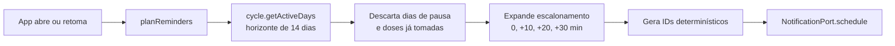

# Fase 1 — Domínio

## Objetivo

Implementar toda a regra de negócio em `packages/core`, com testes, **sem escrever uma linha
de UI**. Ao final desta fase o Pillify já "funciona" — só não tem tela.

Esta é a fase mais importante do projeto. O cálculo de cartela é onde os bugs são
silenciosos e caros: um erro aqui não trava o app, apenas faz alguém tomar o remédio no dia
errado.

## Tecnologias

| Ferramenta | Versão | Papel |
| --- | --- | --- |
| TypeScript | 7.0.2 | Única linguagem do pacote |
| date-fns | 4.4.0 | Aritmética de datas com suporte a fuso |
| Vitest | 4.1.10 | Testes unitários, ambiente `node` |

Nenhuma outra dependência. `packages/core` não conhece React, Dexie, Capacitor nem o DOM.

## Arquitetura

```
packages/core/src/
├─ domain/
│  ├─ medication.ts      # Medication, CycleConfig
│  ├─ dose.ts            # DoseLog, DoseStatus, DoseId
│  ├─ reminder.ts        # PlannedReminder, ReminderPolicy
│  └─ errors.ts          # erros de domínio tipados
├─ ports/
│  ├─ clock.ts
│  ├─ storage.ts
│  └─ notification.ts
├─ services/
│  ├─ cycle.ts           # dia da cartela, dias de pausa
│  ├─ doseState.ts       # derivação de status
│  └─ scheduler.ts       # horizonte de lembretes
├─ usecases/
│  ├─ planReminders.ts
│  ├─ takeDose.ts
│  ├─ snoozeDose.ts
│  └─ getDashboard.ts
└─ index.ts              # superfície pública do pacote
```

### Modelo

```ts
type CycleConfig =
  | { kind: 'continuous' }
  | { kind: 'cyclic'; activeDays: number; breakDays: number }; // 21+7, 24+4

interface Medication {
  id: string;
  name: string;
  timeOfDay: string;        // "08:00", hora de parede local (ADR-006)
  cycle: CycleConfig;
  cycleStartDate: string;   // "2026-07-01", âncora da derivação (ADR-003)
  graceMinutes: number;     // após isso, 'pending' vira 'missed'
  active: boolean;
}

type DoseStatus = 'pending' | 'taken' | 'snoozed' | 'missed';

interface DoseLog {
  id: DoseId;               // `${medicationId}:${YYYY-MM-DD}`
  medicationId: string;
  scheduledFor: string;     // ISO datetime com offset
  status: DoseStatus;
  takenAt?: string;
  snoozedUntil?: string;
}

interface ReminderPolicy {
  escalationOffsetsMinutes: number[];  // [0, 10, 20, 30]
  snoozeMinutes: number;               // 10
  horizonDays: number;                 // 14
}
```

### Fluxo do planejamento



### Chaves determinísticas

Duas chaves sustentam a idempotência descrita no
[ADR-004](00-arquitetura.md#adr-004--agendamento-idempotente-com-horizonte-rolante):

- **`DoseId`** = `${medicationId}:${YYYY-MM-DD}`. Uma dose por remédio por dia.
- **`ReminderId`** = `${DoseId}#${attempt}`, onde `attempt` é o índice no escalonamento.

Como são derivadas puramente dos dados, replanejar o mesmo horizonte produz exatamente o
mesmo conjunto de IDs. Nenhum estado de "já agendei isso" precisa ser guardado.

## Decisões

### D1.1 — `cycle.ts` deriva, não conta

Detalhado no [ADR-003](00-arquitetura.md#adr-003--estado-do-ciclo-é-derivado-nunca-contado).
Na prática, a assinatura central é:

```ts
function getCycleDay(med: Medication, date: Date): CycleDay;

type CycleDay =
  | { kind: 'active'; dayInCycle: number; totalActive: number }   // "Dia 14/21"
  | { kind: 'break'; dayInBreak: number; totalBreak: number };    // "Pausa 2/7"
```

Função pura, sem I/O, sem estado. Recebe a data como parâmetro em vez de consultar o relógio,
o que torna o teste de qualquer cenário trivial.

### D1.2 — `ClockPort` em vez de `new Date()`

Testar "o que acontece se o app ficar 3 dias fechado" exige controlar o tempo. Fazer isso
com mock global de `Date` é frágil e vaza entre testes.

**Decisão:** todo acesso ao tempo passa por `ClockPort`, injetado. Nos testes, um
`FakeClock` avança o tempo explicitamente. A regra é reforçada pelo lint da
[Fase 0](fase-0-scaffold.md#regras-de-lint-que-protegem-a-arquitetura).

### D1.3 — Status derivado, exceto quando é fato

`taken` e `snoozed` são **fatos** e ficam persistidos. `pending` e `missed` são
**interpretações** do tempo corrente e são calculadas na leitura:

```ts
function deriveStatus(log: DoseLog | undefined, med: Medication, now: Date): DoseStatus;
```

Sem isso, marcar uma dose como `missed` exigiria um processo em background rodando à
meia-noite — complexidade desnecessária e um ponto de falha a mais.

### D1.4 — date-fns em vez da Temporal API

A Temporal API resolveria fuso e hora de parede de forma mais elegante e sem dependência.

**Decisão:** usar date-fns 4 por ora. O suporte a Temporal ainda é desigual entre a WebView
do Android e os navegadores de desenvolvimento, e depender de polyfill num domínio que se
quer sem dependências é pior que uma biblioteca madura.

**Reversibilidade:** toda a aritmética de data fica confinada em `services/cycle.ts` e num
módulo `dateUtils.ts`. Migrar para Temporal depois é trocar a implementação desses dois
arquivos, sem tocar em nenhum caso de uso.

### D1.5 — Instante montado em hora local, nunca via UTC

O `scheduler.ts` converte `timeOfDay` ("08:00") num instante concreto. Essa conversão é o
ponto exato onde apps de lembrete costumam errar.

**Decisão:** montar o `Date` com o construtor de componentes locais,
`new Date(year, monthIndex, day, hours, minutes)`, aplicando horas e minutos diretamente sem
nenhuma passagem por UTC no meio do cálculo. Avanço de dias usa `addDays` do date-fns, nunca
soma de `86_400_000` milissegundos.

A regra completa, com os dois antipadrões que produzem o mesmo resultado errado, está em
[ADR-006](00-arquitetura.md#como-o-schedulerts-monta-o-instante). O resumo do risco: somar
milissegundos assume que todo dia tem 24 horas, o que é falso nos dias de transição de
horário de verão, e o bug se manifesta uma vez por semestre deslocando a dose em uma hora.

O `ClockPort` expõe `timeZone()` justamente para que os testes de transição possam simular
fusos que ainda observam horário de verão, já que o Brasil não observa desde 2019.

### D1.6 — `ReminderPolicy` como dado, não como constante

O escalonamento `[0, 10, 20, 30]` é um chute. A Fase 4 vai dizer se é insistente demais
(vira irritação e o usuário desliga tudo) ou de menos.

**Decisão:** a política é um objeto de configuração que atravessa o domínio como parâmetro.
Ajustá-la depois da validação é mudar um valor, não caçar números mágicos.

### D1.7 — Erros de domínio tipados, sem `throw` de string

Casos como "data de início no futuro", "configuração de ciclo inválida" ou "dose de dia de
pausa" retornam erros tipados em vez de exceções genéricas, para que a UI possa tratar cada
um com mensagem específica.

## Cobertura de testes exigida

Os cenários abaixo são obrigatórios, porque cada um já quebrou algum app de lembrete no
mundo real:

- Ciclo contínuo, 21+7 e 24+4, ao longo de três ciclos completos.
- Virada de mês e virada de ano dentro de um ciclo.
- App fechado por 3 e por 40 dias: o dia da cartela derivado continua correto.
- Dose tomada antes do horário agendado (o usuário tomou às 7h40 uma dose das 8h).
- Dose adiada duas vezes seguidas.
- Dose de dia de pausa não gera lembrete.
- Remédio desativado no meio do horizonte cancela os lembretes futuros.
- Mudança de `timeOfDay` replaneja e cancela os IDs antigos.
- Mudança de fuso horário do dispositivo (viagem) mantém a hora de parede.
- Horário de verão: transição de ida e de volta não duplica nem pula uma dose, e o instante
  agendado continua às 08:00 de parede nos dois lados da transição (D1.5).
- Horizonte que atravessa uma transição de horário de verão: os 14 dias planejados têm todos
  a mesma hora de parede, e nenhum tem 23h ou 25h de diferença do anterior.
- Idempotência: chamar `planReminders` duas vezes seguidas produz o mesmo conjunto de IDs.

## Entregáveis

- [ ] Tipos de domínio em `src/domain/`
- [ ] Interfaces de porta em `src/ports/`
- [ ] `cycle.ts`, `doseState.ts` e `scheduler.ts` com testes
- [ ] Casos de uso `planReminders`, `takeDose`, `snoozeDose`, `getDashboard`
- [ ] `FakeClock` e `InMemoryStorage` como test doubles reutilizáveis
- [ ] `index.ts` exportando apenas a superfície pública
- [ ] Suíte de testes cobrindo todos os cenários da lista acima

## Critério de pronto

`pnpm test` passa com todos os cenários listados. É possível simular um ciclo 21+7 completo
inteiramente em memória, avançando o `FakeClock` dia a dia, e observar os estados corretos
sem existir navegador nem UI. O lint confirma que nenhum import proibido entrou.
