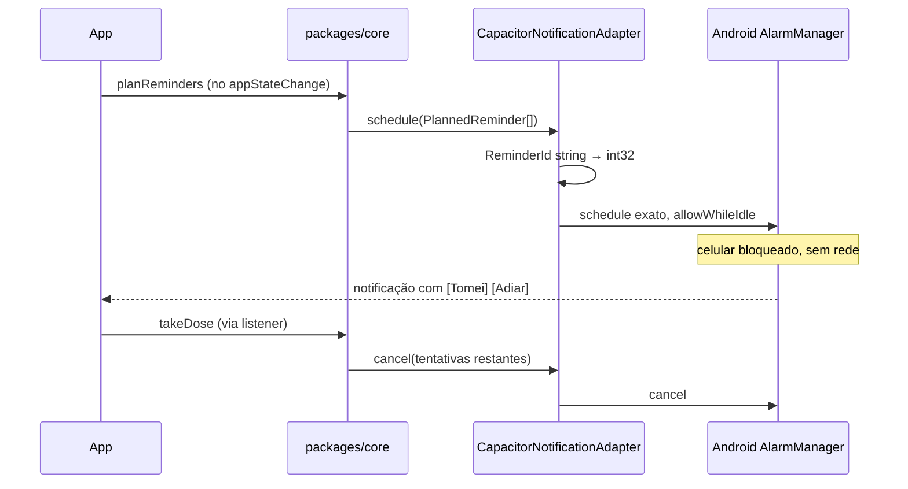

# Fase 3 — Capacitor Android

## Objetivo

Transformar o app web numa build Android nativa com **lembretes confiáveis**: horário exato,
funcionando offline, com o celular bloqueado, e com botões acionáveis reais na notificação.

Esta é a fase que entrega a hipótese central do produto
([ADR-001](00-arquitetura.md#adr-001--validação-em-android-nativo-e-não-em-pwa)).

## Tecnologias

| Ferramenta | Versão | Papel |
| --- | --- | --- |
| `@capacitor/core` | 8.4.2 | Ponte JS ↔ nativo |
| `@capacitor/cli` | 8.4.2 | `cap add`, `cap sync`, `cap run` |
| `@capacitor/android` | 8.4.2 | Projeto Android |
| `@capacitor/local-notifications` | 8.2.1 | Alarmes exatos e notificações acionáveis |
| `@capacitor/app` | 8.1.1 | Ciclo de vida via `appStateChange`, gatilho do replanejamento |
| Android Studio + JDK 21 | — | Toolchain de build (a instalar) |

## Arquitetura

```
apps/web/
├─ capacitor.config.ts
├─ android/                        # gerado por cap add android
│  └─ app/src/main/
│     ├─ AndroidManifest.xml       # permissões
│     └─ res/                      # ícones, som do canal
└─ src/adapters/notifications/
   ├─ CapacitorNotificationAdapter.ts
   └─ reminderIdHash.ts            # string → int32
```

### Configuração

```ts
// capacitor.config.ts
const config: CapacitorConfig = {
  appId: 'com.cenora.pillify',
  appName: 'Pillify',
  webDir: 'dist',
  android: { allowMixedContent: false },
  plugins: {
    LocalNotifications: {
      smallIcon: 'ic_stat_pill',
      iconColor: '#E11D48',
      sound: 'reminder.wav',
    },
  },
};
```

### Fluxo de uma dose



### Permissões no `AndroidManifest.xml`

| Permissão | Motivo |
| --- | --- |
| `POST_NOTIFICATIONS` | Obrigatória desde o Android 13. Precisa de solicitação em runtime |
| `USE_EXACT_ALARM` | Alarme em horário exato sem pedir concessão ao usuário. Desde o Android 12 |
| `RECEIVE_BOOT_COMPLETED` | Reagendar os alarmes após reinicialização do aparelho |
| `VIBRATE` | Vibração junto do alerta |

### Canal de notificação

O Android agrupa notificações por canal, e a importância é definida **na criação** do canal e
não pode ser elevada depois. Um canal criado com importância baixa fica silencioso para sempre,
mesmo que o código mude.

**Decisão:** criar o canal `pillify-dose-reminder` com `importance: 5` (máxima), som
customizado, vibração e `visibility` pública na primeira execução. Se a política mudar, o canal
antigo é descartado e um novo ID é criado.

## Decisões

### D3.1 — Capacitor dentro de `apps/web`, sem app separado

**Decisão:** o Capacitor é inicializado dentro de `apps/web`, e a pasta `android/` nasce ali.
Não existe `apps/mobile`.

O Capacitor consome o `dist/` estático do Vite — criar um pacote separado exigiria duplicar
build e configuração para embrulhar exatamente o mesmo bundle. A escolha do adapter em runtime
já resolve a diferença de plataforma.

### D3.2 — `android/` versionado no Git

**Decisão:** commitar a pasta `android/` (exceto `build/`, `.gradle/` e `local.properties`).

O Capacitor trata o projeto nativo como código-fonte do projeto, não como artefato gerado.
Configurações que faremos à mão — permissões, ícones, som, e o widget da Fase 5 — vivem lá e
seriam perdidas num `cap add android` limpo.

### D3.3 — Hash determinístico de ID no adapter, não no domínio

`@capacitor/local-notifications` exige IDs **inteiros de 32 bits assinados**. O domínio
trabalha com `ReminderId` string legível (`med-1:2026-07-29#2`).

**Decisão:** o adapter aplica um hash determinístico com operadores bitwise, garantindo o
intervalo válido do `int` do Java, e mantém o mapeamento reversível persistido para que
`cancel` e `listPending` consigam correlacionar. O domínio nunca vê inteiros.

A implementação, a justificativa do `hash |= 0` dentro do laço e o motivo de usar
`& 0x7fffffff` em vez de `Math.abs` estão em
[ADR-004 — Conversão de ID para int32](00-arquitetura.md#conversão-de-id-para-int32).

**Risco:** colisão de hash. Com o horizonte de 14 dias e poucos remédios, o espaço usado é de
dezenas de IDs contra 2³¹ possíveis, então a probabilidade é desprezível. Ainda assim, o
adapter detecta colisão na escrita do mapeamento e resolve por sondagem linear.

### D3.4 — `allowWhileIdle` e alarme exato

O modo Doze do Android agrupa alarmes em janelas de manutenção para economizar bateria, o que
pode atrasar um lembrete em dezenas de minutos.

**Decisão:** agendar com `allowWhileIdle: true` e horário exato. Um lembrete de remédio é
exatamente o caso de uso que o Android considera legítimo para essa permissão.

### D3.5 — Reagendamento após reboot deve ser verificado, não assumido

Alarmes do `AlarmManager` são apagados quando o aparelho reinicia. O plugin do Capacitor
registra um receiver de `BOOT_COMPLETED` para restaurá-los.

**Decisão:** tratar isso como comportamento **a validar**, não como garantia. O roteiro da
[Fase 4](fase-4-validacao.md) inclui um teste explícito de reboot.

A rede de segurança não depende disso funcionar. O replanejamento do horizonte
([ADR-004](00-arquitetura.md#gatilho-do-replanejamento)) reconstrói qualquer alarme perdido
assim que o app volta ao primeiro plano, seja depois de um reboot, de o sistema ter matado o
processo ou de o gerenciador de bateria do fabricante ter limpado os agendamentos. Por isso o
listener de `appStateChange` é o ponto mais crítico de toda a Fase 3: se ele falhar, o app
degrada silenciosamente, sem erro visível, e só se percebe quando um lembrete não toca.

### D3.6 — Live reload durante o desenvolvimento nativo

Configurar `server.url` apontando para o Vite dev server na rede local permite iterar no
aparelho físico sem rebuildar o Gradle a cada mudança.

**Decisão:** manter isso numa configuração separada, ativada por variável de ambiente, e
**nunca** na configuração de build de release. Um `server.url` esquecido num APK distribuído
significa um app que só funciona na sua rede doméstica.

### D3.7 — Escopo Android apenas

**Decisão:** não adicionar a plataforma iOS nesta fase. Exige macOS e conta de desenvolvedor
Apple, e o aparelho de validação é Android. iOS fica na
[Fase 5](fase-5-pos-validacao.md), se houver demanda.

## Riscos conhecidos

| Risco | Mitigação |
| --- | --- |
| Fabricantes com bateria agressiva (Xiaomi, Samsung, Huawei) matam alarmes mesmo com `allowWhileIdle` | Onboarding orienta a adicionar o app às exceções de otimização de bateria. Validado na Fase 4 |
| Gradle não resolve plugins por causa dos symlinks do pnpm | `node-linker=hoisted` no `.npmrc`, configurado desde a Fase 0 |
| IndexedDB despejado pela WebView sob pressão de memória | Item explícito no roteiro de teste da Fase 4 |
| Limite de notificações pendentes do sistema | Horizonte rolante de 14 dias mantém o total na casa das dezenas |

## Entregáveis

- [ ] Capacitor instalado e `capacitor.config.ts` configurado
- [ ] `pnpm cap add android` executado e projeto abrindo no Android Studio
- [ ] Permissões declaradas no `AndroidManifest.xml`
- [ ] Canal de notificação de importância máxima com som customizado
- [ ] Ícone do app e `ic_stat_pill` monocromático para a barra de status
- [ ] `CapacitorNotificationAdapter` implementando `NotificationPort`
- [ ] `reminderIdHash.ts` com testes de determinismo e colisão
- [ ] Action types `[Tomei]` e `[Adiar 10 min]` registrados
- [ ] Listener de `localNotificationActionPerformed` conectado aos casos de uso
- [ ] Listener de `appStateChange` do `@capacitor/app` disparando o replanejamento quando
      `isActive === true`
- [ ] Solicitação de permissão de notificação no onboarding
- [ ] Script `pnpm mobile:build` encadeando build do Vite e `cap sync`

## Critério de pronto

Com o app instalado num aparelho físico, fechado (não apenas em segundo plano), o celular
bloqueado e em **modo avião**, a notificação dispara no horário exato com som de prioridade.
Tocar em "Tomei" registra a dose e cancela os lembretes escalonados restantes. Reabrir o app
mostra o estado correto.
